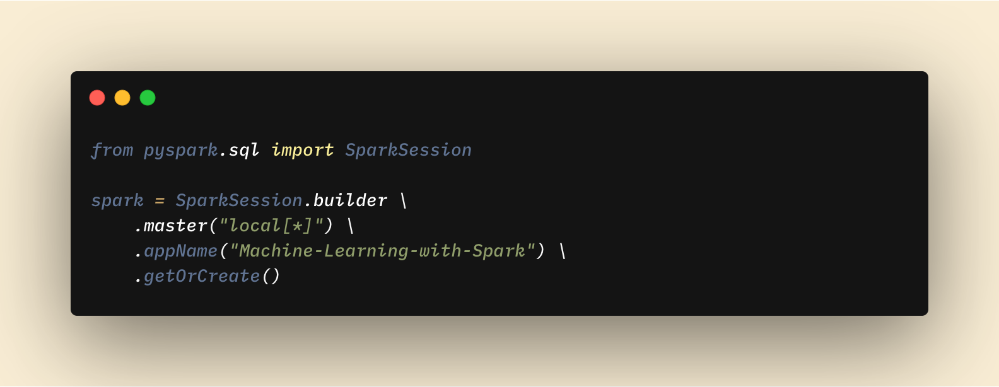
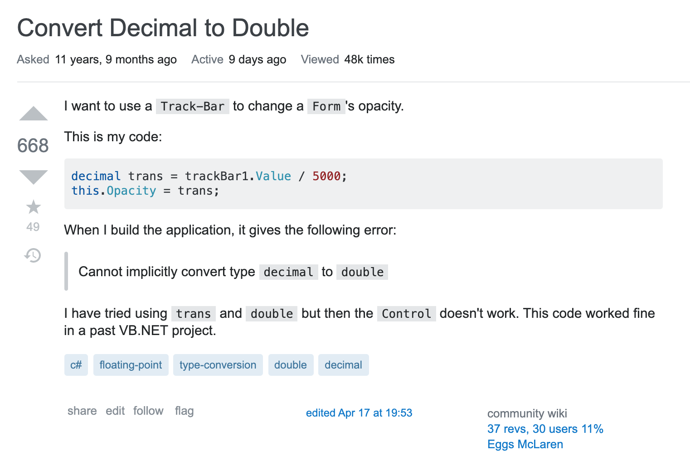
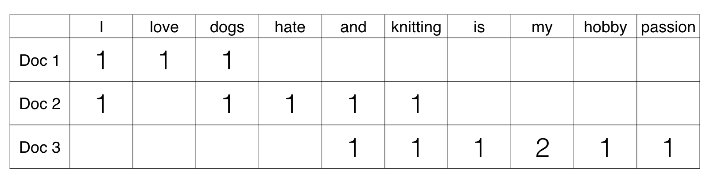

# Final Project - Use Spark for Machine Learning

Stackoverflow | Apache Spark
:----- |  ------:
 | 

Using Machine Learning with Spark.

## Dataset

Our dataset is the [StackExchange Data Dump](https://archive.org/details/stackexchange).

This dataset is an anonymized dump of all user-contributed content on the Stack Exchange network. Each site is formatted as a separate archive consisting of XML files zipped via 7-zip using bzip2 compression. Each site archive includes Posts, Users, Votes, Comments, PostHistory and PostLinks. We are only interested in a small portion of this dataset.

StackExchange has nice tools on their dataset, where you can query the actual website through their [StackExchange Data Explorer](https://data.stackexchange.com/stackoverflow/queries?order_by=featured). You can use this tool using  **SQL** to understand more on the data.

We will be focusing to `stackoverflow.com-Posts.7z`. This file **contains 34Gb of uncompressed data**, approximately 70% of this dataset is in text format, which is the questions people asked at [Stackoverflow](https://stackoverflow.com/). This amount of data, most likely, does not fit your memory. 

[Dmitry Petrov](https://fullstackml.com/@fullstackml), an Ex-Data Scientist @Microsoft, mentioned in one of his article, [how to use this dataset](https://fullstackml.com/how-to-find-simple-and-interesting-multi-gigabytes-data-set-f7d9b42f525). He has another nice article on [how to clean this dataset](https://fullstackml.com/beginners-guide-apache-spark-machine-learning-scenario-with-a-large-input-dataset-1f0c6bc53f8f), however, he did it using Scala, which is a good and a bad news for you. Good side is that you can see how he did it, which may help you with your exercise!

A sample question in this dataset looks like the following in stackoverflow. You can actually find the questions through the `id` field from the website, i.e., for the below question, [this link](https://stackoverflow.com/questions/4/convert-decimal-to-double) is where you can find the question on the website.



The data from the file is the following.

``` html
<row 
    Id="4"
    PostTypeId="1"
    AcceptedAnswerId="7"
    CreationDate="2008–07–31T21:42:52.667"
    Score="322"
    ViewCount="21888"
    Body="&lt;p&gt;I want to use a track-bar to change a form’s opacity.&lt;/p&gt; &lt;p&gt;This is my code:&lt;/p&gt; &lt;pre&gt;&lt;code&gt;decimal trans = trackBar1.Value / 5000; this.Opacity = trans; &lt;/code&gt;&lt;/pre&gt; &lt;p&gt;When I try to build it, I get this error:&lt;/p&gt; &lt;blockquote&gt; &lt;p&gt;Cannot implicitly convert type ‘decimal’ to ‘double’.&lt;/p&gt; &lt;/blockquote&gt; &lt;p&gt;I tried making &lt;code&gt;trans&lt;/code&gt; a &lt;code&gt;double&lt;/code&gt;, but then the control doesn’t work. This code has worked fine for me in VB.NET in the past. &lt;/p&gt; "
    OwnerUserId="8"
    LastEditorUserId="451518"
    LastEditorDisplayName="Rich B”
    LastEditDate="2014–07–28T10:02:50.557"
    LastActivityDate="2014–12–20T17:18:47.807"
    Title="When setting a form’s opacity should I use a decimal or double?”
    Tags="&lt;c#&gt;&lt;winforms&gt;&lt;type-conversion&gt;&lt;opacity&gt;”
    AnswerCount="13"
    CommentCount="1"
    FavoriteCount="27"
    CommunityOwnedDate="2012–10–31T16:42:47.213"
/>
```

## Tasks

Your mission, should you choose to accept it, is to use this dataset and apply machine learning on it.

> From the `Body` and `Title`, find out what is the language (python, java, sql, etc.) of the question. (Classification)

<sub>You can use other fields as your features as well.</sub>

### 0. Prepare the Dataset in Tabular Format

This dataset is provided in XML files, and in that files, the data is provided as html tags. In order to perform an analysis, you need to prepare the dataset in a tabular form.

If there is an XML reader in Spark API, you can utilize that one and you may come up to bring this data in tabular form.

### 1. EDA

In this part, you will have to achieve **at least 3** of the following list.

1. Prepare graphical representation of `overall`
2. Get the count of most common words
3. Categorize the length of posts
4. Find lexicality score and perplexity score of the dataset
5. Graph a [dispersion plot](https://www.nltk.org/book/ch01.html) for some words.
6. Find the total # of sentences in the whole dataset
7. Find the total # of words in the whole dataset
9. Find the total # of characters in the whole dataset
10. Find the percentage of special characters (punctuations, numbers, etc) over all words

### 2. Data Processing

Second, and the most important part of the project is to apply text processing to the dataset. 

Again, **at least 3** of the following list should be applied to your processing step. **Bolded** ones **must** be implemented.

1. Removing punctations
2. Lowercasing words
3. Removing stopwords
4. **Lemmatization**
5. Stemming
6. Removing top n% and lowest n% most used words from dataset
7. Correcting spelling for words
8. Tokenizing posts into sentences
9. **Tokenizing posts into words**
10. Removing short words (len(word) > n)

After cleaning your data and come up with a final version, it may be a good practice to `persist` the dataset into disk in Spark so that you don't have to run the previous steps again.

``` py
df.persist(pyspark.StorageLevel.DISK_ONLY)
```
### Machine Learning

In this part, we will create our X and y matrices and apply some algorihms to do NLP tasks. In order to do that, **one step** in the following list **must** be implemented.

1. Create [TF-IDF](https://en.wikipedia.org/wiki/Tf%E2%80%93idf) matrix.
2. Create [Bag of Words](https://en.wikipedia.org/wiki/Bag-of-words_model) model with Count
3. Create Bag of Words model with Normalized Count
4. Create Doc2Vec representations
3. Create [Word Embeddings](https://en.wikipedia.org/wiki/Word_embedding)

Each one of these transformations will create a numerical representation of your words dataset. For example, after applying one of the above transformations, your data should look like in the following image.



As you guessed, this will be your `X`.

Second, you need to prepare your `y` dataset as well. 

Third, data should be divided into `training` and `test` splits. This part is essential to test the validity of our machine learning models.

Finally, after you have your `X` and `y`, it is time to apply some algorithms. At least three algorithms must be tried in our project.

Some of these algorithms, however not all, are in the follwing list.

1. KMeans
2. Naive Bayes
3. Logistic Regression
2. SVM, SGDClassifier
3. Birch
4. Latent Dirichlet Allocation (LDA)
5. Hierarchical Dirichlet Process (HDP) Model
6. Latent semantic indexing (LSI) Model
7. Mallet
8. Random Projections (RP) Model
9. TFIDFModel
10. NormModel
11. LogEntropyModel
12. Neural Networks
13. Linear Regression

### Validation


Validation is the part you run some sort of testing code to test your validity of your machine learning model.

It may have (or not) any of the following from below list, you must do **at least one** of the validation.

1. Precision, Recall, and Accuracy
2. Confusion matrix, roc curve, auc
3. Coherence

### Testing

You must **at least try one** post that is out of your `training` and `test` dataset. 

You should print the result of your model. For example, one such example could be following pseudocode.

``` py
test_body_string = "some python question..." 

with open('my_trained_model.pkl', 'rb') as _file:
    model = _file.read()

results = model.evaluate(test_string)
print(results)

>>> {'lang': 'python'}
```

As seen in above pseudocode, [pickling](https://docs.python.org/3/library/pickle.html) can be a good solution after you come up with your ML model. [Saving and Loading ML models](https://machinelearningmastery.com/save-load-machine-learning-models-python-scikit-learn/) can be handy. 

## Tech Stack

Download the data as Dmitry suggested via torrent, or through the website. Store it in your Google Drive. Our school google accounts have unlimited amount of data storage, so you may not have a problem with it.

Use Google Colab and link your Google Drive to the Colab Notebook. You may find examples of how this is done. Check out this [notebook](https://colab.research.google.com/notebooks/io.ipynb) for more information on IO operations for Google Colab.

``` py
from google.colab import drive
drive.mount('/content/drive')
```

While doing this project, your must use `Apache Spark` in order to do operations. Our main focus is to learn Pyspark API, therefore, we will be using that.

PS: Don't confuse *Spark* with *pyspark*. *Spark* is the JVM applcation to do big data analytics, *pyspark* is the python API to interact with Spark. You need both to be installed in the platform you want to use.

### How can I run spark?

As you already know from previous classes, we have multiple options.

1. Google Colab **(Recommended)**
2. Databricks
3. Spark on Docker on your own computer
4. Installing Spark Locally
5. ~~SPU [Data Science Lab](https://dsl.saintpeters.edu/doku.php) (DSL) (Thanks to @SaintPetersU)~~ *
6. ~~[Apache Zeppelin](https://dsl.saintpeters.edu:8443) Notebooks available in SPU DSL.~~ *

<sub>* 5 and 6 not available due to COVID 19 and VPN restrictions.</sub>

## How to do the Project?

To do this project, you need to complete the task given above in the following format.

1. Create Jupyter Notebook files for each section of the [Tasks](#tasks).
2. Create a final presentation that should target business users.
    - Describe the dataset in general.
    - Describe the dataset in detail with your findings on EDA.
    - Specify your goal and explain your ML process.
    - Talk about your ML model you have created, not the code.
    - Share the validation results and model tests your achieved.
    - Make a conclusion.
3. Create a new README file, replacing this one as `Instructions.md`, and make an overview of the project, as if it is targeting business users and developers.
    - Describe your project.
    - Share how to replicate the analysis. Tell us about how to setup the environment so that the notebooks can run.
    - Talk about the data.
    - Anything that you think will be needed.

<sub>#3 is the first thing any developer or business people whom you may want to show your project. Make it to catch the audience's attention to the subject, not to get a better grade.</sub>

Your notebooks should also have some **titles, descriptions, explanations, etc** (Making Cell as Markdown) as well, to make the notebooks **self explanatory** and **visually appealing**.

Your notebooks should be **reproducible**, meaning that, following your instructions, any other person should **be able to regenerate** the analysis you have made.

## What are all these other files?

Following table is will give it a meaning for each file.

File                | Description 
-------             | ----------- 
README.md **        | A descriptive file to give an introduction of current project/ assignment. 
Instructions.md **  | A copy of current README.md file. 
LICENCE **          | The licence of the file that every project should have.
.gitignore          | The file to control which files should be ignored by Git.
*.ipynb             | Assignment notebook with your Spark code.
